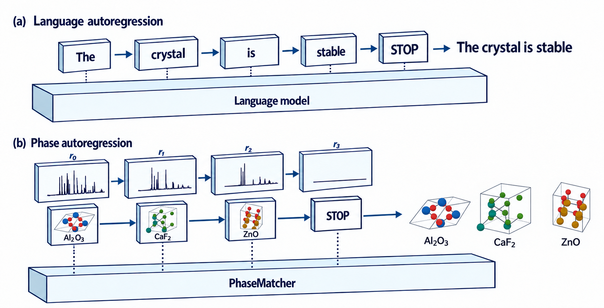

<div align="center">

# PhaseMatcher

### Autoregressive phase-set identification from powder X-ray diffraction

**[English](README.md) · [简体中文](README.zh-CN.md)**

[Quick start](#quick-start) · [Data & weights](docs/resources.md) · [Training](docs/training.md) · [Architecture](docs/architecture.md)

</div>

PhaseMatcher identifies a complete phase set from a powder XRD pattern, without requiring the phase count as input. It selects reference-library entries one at a time, reconstructs phase contributions and a residual, and learns when to stop.



- **Full-library identification:** predict phases from the complete reference library.
- **Physics-guided decomposition:** estimate physical deformation parameters and allocate observed intensity to selected phases and the residual.
- **Greedy or Beam:** follow one path or retain multiple candidates; optionally start from known phases.

## Quick start

### 1. Install

Requires Python 3.10+ and PyTorch 2.4+. For GPU inference, install a CUDA-compatible PyTorch build first.

```bash
git clone https://github.com/ucaspzl/PhaseMatcher.git
cd PhaseMatcher
python -m venv .venv
```

Activate with `source .venv/bin/activate` on Linux/macOS, or `.venv\Scripts\Activate.ps1` in Windows PowerShell. Then:

```bash
python -m pip install -e ".[dev]"
python -m pytest -q
```

Tests use small generated fixtures and do not require datasets or pretrained weights.

### 2. Get data and weights

| Dataset | Reference entries | Data / setup | Final weights |
|---|---:|---|---|
| PhaseMix-135K | 135,258 | [Hugging Face](https://huggingface.co/datasets/pengzhonglong/PhaseMix-135k) | [Download last](https://github.com/ucaspzl/PhaseMatcher/releases/download/checkpoints-v1/phasemix-last.pt) |
| RRUFF-based mixtures | 740 | [Data layout](docs/resources.md#rruff-data) | [Download last](https://github.com/ucaspzl/PhaseMatcher/releases/download/checkpoints-v1/rruff-last.pt) |

Download the checkpoint for your dataset and follow the [setup guide](docs/resources.md) to place the files and verify their checksums.

### 3. Run a test-set example

After placing the dataset and its final `last.pt` checkpoint:

```bash
python examples/predict_sample.py --config configs/phasemix.yaml --device cpu
```

The example constructs one held-out mixture using the dataset's test recipe, predicts its phases, and saves:

```text
outputs/example/
├── input.npy             XRD pattern supplied to the model
├── predictions.json      library IDs, source record IDs and path scores
└── decomposition.npz     contributions, residual and deformation parameters
```

The model receives the observation and reference library, **not the sample's labels or phase count**. Add `--strategy beam --beam-size 10` for Beam or `--device cuda` for GPU inference. Use `--config configs/rruff.yaml` for RRUFF. This example requires real assets; it does not substitute random weights.

## Use your own spectrum

Input is a nonnegative NumPy array shaped `[3501]` or `[B, 3501]`, on a 2θ grid from 10° to 80° at 0.02° spacing. See [inference and output formats](docs/usage.md) for preprocessing, commands and known-phase continuation.

For a small evaluation after downloading the assets:

```bash
phasematcher evaluate --config configs/phasemix.yaml --limit 8 --device cpu
```

Remove `--limit 8` for the complete test split. See [training and evaluation](docs/training.md) for stage initialization, recovery and multi-GPU evaluation.

## Code map

```text
src/phasematcher/
├── models/          spectrum encoder, Phase/STOP heads, spectral decomposition
├── data/            reference libraries and mixture construction
├── training/        objectives, candidate sampling and optimization
├── inference/       Greedy/Beam with per-path residuals
├── checkpoint.py    checkpoint loading and reference-order validation
├── metrics.py       set identification and phase-count metrics
└── cli.py           check, predict, evaluate and train commands
```

Start with [models/system.py](src/phasematcher/models/system.py), then [inference/search.py](src/phasematcher/inference/search.py). Configurations live in `configs/`, runnable examples in `examples/`, and regression tests in `tests/`.

This repository contains PhaseMatcher only: source code, configurations, examples, tests, documentation, and resource metadata. Baseline implementations are not bundled. Checkpoints are distributed through Releases; datasets are hosted separately.

| Guide | Contents |
|---|---|
| [Resources](docs/resources.md) | Download locations, placement and integrity checks |
| [Usage](docs/usage.md) | Input preparation, outputs and Python interfaces |
| [Training](docs/training.md) | Three stages, initialization, recovery and evaluation |
| [Architecture](docs/architecture.md) | Components, data flow and tensor interfaces |
| [Data specification](docs/data.md) | Splits, array fields and observation construction |

## License

PhaseMatcher's original code and the two final checkpoints are released under the [MIT License](LICENSE). Datasets and third-party content retain their own terms; see [licensing details](docs/licensing.md).
